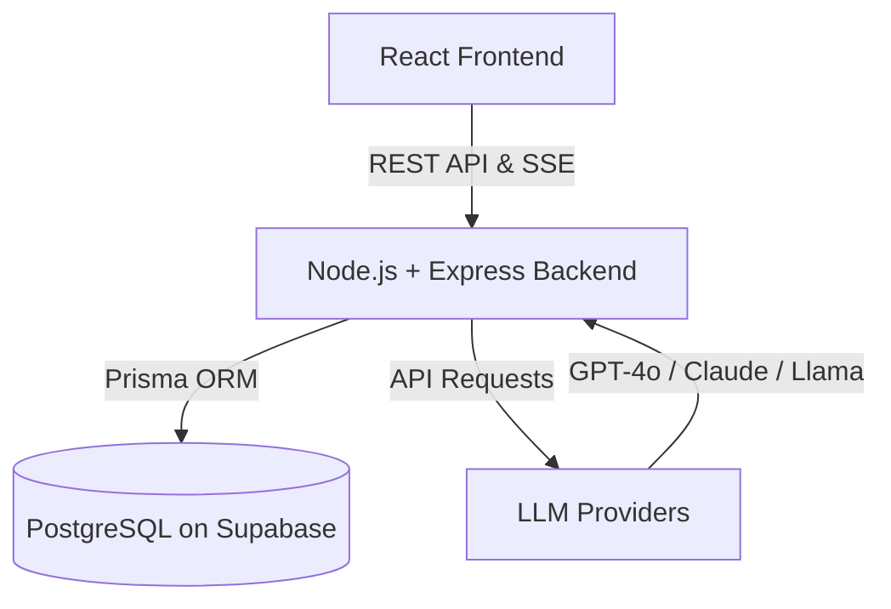

<div align="center">
  
  <h1>Khedma AI</h1>
  <p><em>AI-powered Job Description Generator for HR teams and recruiters</em></p>

  <!-- Badges -->
  
  
  
  
  
  
  
</div>

## Table of Contents
- [Project Overview](#project-overview)
- [Key Features](#key-features)
- [Architecture Overview](#architecture-overview)
- [Technology Stack](#technology-stack)
- [Installation Guide](#installation-guide)
- [Environment Variables Reference](#environment-variables-reference)
- [API Reference](#api-reference)
- [CI/CD Pipeline](#cicd-pipeline)
- [Project Structure](#project-structure)
- [Contributing Guidelines](#contributing-guidelines)
- [License](#license)

## Project Overview
**Khedma AI** is a state-of-the-art Job Description Generator designed specifically for HR teams, hiring managers, and recruiters. The application streamlines the creation of comprehensive, inclusive, and tailored job descriptions using advanced LLM capabilities. It dramatically reduces the time spent on drafting and iterating job posts, ensuring consistency and quality across all recruitment materials.

## Key Features
- 🤖 **Multi-LLM Support**: Generate descriptions using OpenAI (GPT-4o, GPT-4o-mini), Anthropic (Claude 3.5 Sonnet, Haiku), OpenRouter (Llama 3.1, Mistral, DeepSeek, Gemma), or local models via Ollama.
- 🌍 **Multilingual**: Create job descriptions in English, French, and Arabic with full RTL support.
- ⚡ **Real-time Streaming**: Experience fast generation with Server-Sent Events (SSE) streaming.
- 📝 **Granular Refinement**: Improve, expand, shorten, or make specific sections more inclusive using AI.
- 🕰️ **Version History**: Track and revert to previous versions of job descriptions.
- 💾 **Draft Management**: Save drafts and favorite specific descriptions for quick access.
- 📊 **Usage Analytics**: Monitor token usage and generation statistics.
- 🛡️ **Sandbox Mode**: Test the UI with simulated streaming without requiring an API key.

## Architecture Overview



## Technology Stack

### Frontend
| Technology | Description |
|---|---|
| **React 19** | UI Library |
| **Vite 8** | Build Tool |
| **TypeScript 6** | Strongly typed JavaScript |
| **Tailwind CSS v4** | Utility-first CSS framework |
| **Framer Motion** | Animation library |
| **TanStack Query** | Server state management |
| **i18next** | Internationalization |
| **Lucide React** | Icons |

### Backend
| Technology | Description |
|---|---|
| **Node.js & Express** | Server environment and framework |
| **TypeScript** | Strongly typed JavaScript |
| **Prisma** | Modern ORM |
| **Zod** | Schema validation |
| **Winston** | Logging |

### Infrastructure
| Technology | Description |
|---|---|
| **Netlify** | Frontend hosting |
| **Render** | Backend web service hosting |
| **Supabase** | PostgreSQL database hosting |
| **GitHub Actions** | CI/CD pipeline |

## Installation Guide

### Prerequisites
- Node.js (v20+)
- PostgreSQL database
- API Keys for desired LLM providers

### 1. Clone the repository
```bash
git clone https://github.com/USERNAME/khedma-ai.git
cd khedma-ai
```

### 2. Install dependencies
```bash
# Install frontend dependencies
cd frontend
npm install

# Install backend dependencies
cd ../backend
npm install
```

### 3. Configure Environment Variables
Copy `.env.example` to `.env` in both the `frontend` and `backend` directories and configure the values. See the [Environment Variables Reference](#environment-variables-reference) below.

### 4. Database Migration
```bash
cd backend
npx prisma generate
npx prisma migrate dev --name init
```

### 5. Start Development Servers
```bash
# Start backend server
cd backend
npm run dev

# Start frontend development server (in a new terminal)
cd frontend
npm run dev
```

## Environment Variables Reference

### Backend `.env`
| Variable | Description |
|---|---|
| `NODE_ENV` | Environment (e.g., `development`, `production`) |
| `PORT` | Port for the Express server |
| `DATABASE_URL` | PostgreSQL connection string for Prisma |
| `DIRECT_URL` | Direct connection string |
| `FRONTEND_URL` | URL of the frontend application for CORS |
| `OPENAI_API_KEY` | (Optional) API key for OpenAI |
| `ANTHROPIC_API_KEY` | (Optional) API key for Anthropic |
| `OPENROUTER_API_KEY` | (Optional) API key for OpenRouter |
| `LOCAL_LLM_URL` | (Optional) URL for local Ollama instance |

### Frontend `.env`
| Variable | Description |
|---|---|
| `VITE_API_BASE_URL` | URL of the backend API |

## API Reference

| Method | Route | Description |
|---|---|---|
| `GET` | `/health` | API Health check |
| `GET` | `/api/v1/ai/schema` | Get dynamic sections schema |
| `GET` | `/api/v1/ai/providers` | List available LLM providers & models |
| `GET` | `/api/v1/ai/settings` | Get active provider/model/language |
| `PUT` | `/api/v1/ai/settings` | Update active provider/model/language |
| `POST` | `/api/v1/ai/generate` | SSE streaming job description generation |
| `POST` | `/api/v1/ai/refine-section` | Single-section AI refinement |
| `GET` | `/api/v1/jobs` | List all job descriptions |
| `POST` | `/api/v1/jobs` | Create a new job description |
| `GET` | `/api/v1/jobs/:id` | Get a single job description |
| `PUT` | `/api/v1/jobs/:id` | Update a job description |
| `DELETE` | `/api/v1/jobs/:id` | Delete a job description |
| `GET` | `/api/v1/stats` | Get dashboard statistics |

## CI/CD Pipeline
The project uses GitHub Actions (`.github/workflows/ci.yml`) for continuous integration:
1. **Linting**: Ensures code quality using Oxlint.
2. **Type Checking**: Validates TypeScript definitions.
3. **Testing**: Runs the Vitest suite (13 passing tests for JSON streaming parser + Zod schemas).
4. **Build**: Builds both frontend and backend bundles.

Deployments are automated:
- **Frontend**: Deployed to Netlify (`netlify.toml` configured for SPA).
- **Backend**: Deployed to Render (`render.yaml` configured as a web service).

## Project Structure
```text
khedma-ai/
├── frontend/             # React 19 + Vite + Tailwind
│   ├── src/
│   │   ├── components/   # UI components
│   │   ├── hooks/        # Custom React hooks (e.g., useJobGenerator)
│   │   ├── views/        # Main pages (Dashboard, Generator, Drafts, Settings)
│   │   └── ...
│   ├── public/           # Static assets (including Khedma_logo.png)
│   └── ...
├── backend/              # Node.js + Express + Prisma
│   ├── src/
│   │   └── ...
│   ├── prisma/           # Database schema & migrations
│   └── ...
└── .github/workflows/    # CI/CD actions
```

## Contributing Guidelines
1. Fork the repository.
2. Create your feature branch (`git checkout -b feature/AmazingFeature`).
3. Commit your changes (`git commit -m 'Add some AmazingFeature'`).
4. Push to the branch (`git push origin feature/AmazingFeature`).
5. Open a Pull Request.

Please ensure all tests pass and your code adheres to the existing style guidelines.

## License
Distributed under the MIT License. See `LICENSE` for more information.
