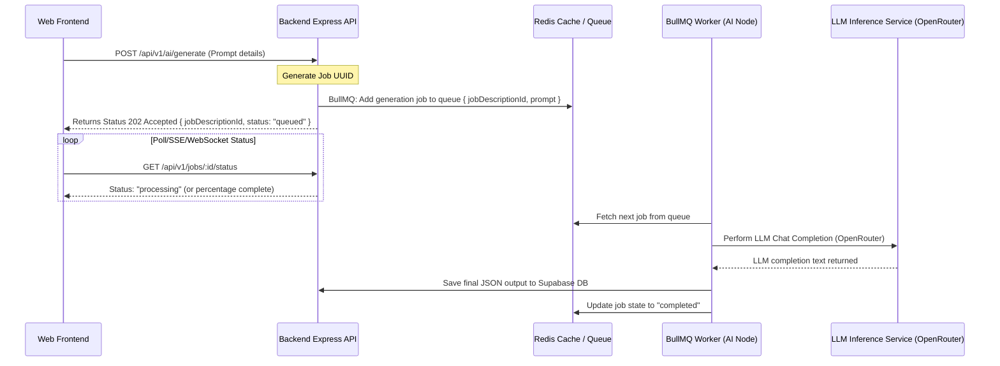

# SaaS Scalability & Future AI Modules Architecture

This document outlines the technical design for scaling **Khedma AI** from a single-user MVP to a multi-tenant enterprise-grade SaaS platform.

---

## 1. Multi-Tenant SaaS Database Partitioning

### Data Isolation Model
To ensure secure data isolation, we propose **Logical Partitioning** at the application and ORM levels. Every table (JobDescription, SystemConfig, UsageStat) is mapped to an `Organization` (Tenant) entity.

### Prisma Schema Update Layout
```prisma
model Organization {
  id              String           @id @default(uuid())
  name            String
  createdAt       DateTime         @default(now())
  users           User[]
  jobDescriptions JobDescription[]
}

model User {
  id             String         @id @default(uuid())
  email          String         @unique
  passwordHash   String
  organizationId String
  organization   Organization   @relation(fields: [organizationId], references: [id])
  createdAt      DateTime       @default(now())
}

model JobDescription {
  id             String         @id @default(uuid())
  organizationId String
  organization   Organization   @relation(fields: [organizationId], references: [id], onDelete: Cascade)
  // ... existing fields
}
```

### Automated Row-Level Filtering (Prisma Extensions)
To prevent developers from accidentally omitting `where: { organizationId }` inside queries (which causes data leakage), we configure a **Prisma Client Extension** to automatically inject the organization ID of the active request:

```typescript
export const prisma = new PrismaClient().$extends({
  query: {
    jobDescription: {
      async $allOperations({ model, operation, args, query }) {
        const organizationId = requestContext.getStore()?.organizationId;
        if (organizationId) {
          // Auto-inject organization filter
          args.where = { ...args.where, organizationId };
        }
        return query(args);
      },
    },
  },
});
```

---

## 2. Asynchronous AI Queueing (BullMQ & Redis)

### Why Asynchronous Queues?
Holding HTTP connections open during long-running LLM calls (e.g. CV screening, massive batches, or detailed report analysis) is highly unstable, leading to gateway timeouts (`504 Gateway Timeout`) and web server resource exhaustion. 

### BullMQ Integration Architecture



### BullMQ Worker Implementation Draft
```typescript
import { Queue, Worker, Job } from 'bullmq';
import IORedis from 'ioredis';

const redisConnection = new IORedis(process.env.REDIS_URL || 'redis://127.0.0.1:6379');

// Queue instance
export const jobGenerationQueue = new Queue('job-generation-queue', { connection: redisConnection });

// Worker instance (can reside on a separate microservice / GPU instance)
const jobWorker = new Worker(
  'job-generation-queue',
  async (job: Job) => {
    const { jobDescriptionId, prompt, provider, model } = job.data;
    console.log(`Processing generation job ${job.id} for ${jobDescriptionId}`);
    
    // Call LLM service and save to Supabase Postgres database
    // ...
  },
  { connection: redisConnection }
);
```
